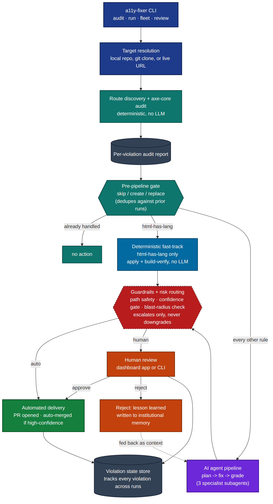
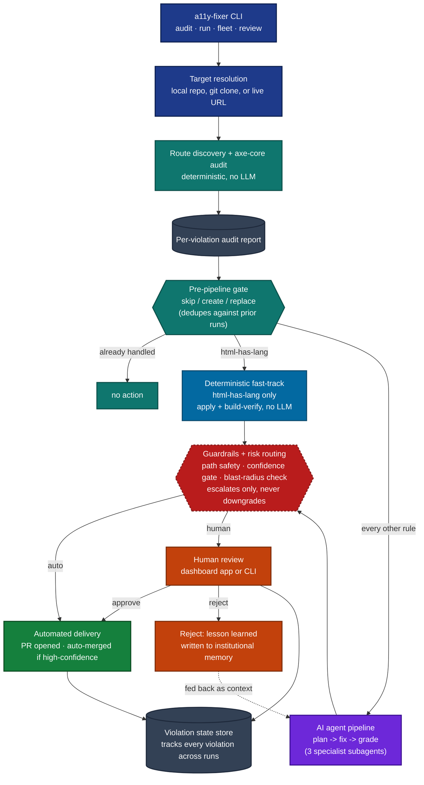

# The A11y Fixer — Architecture (High Level)

Read directly from the `agent/` source (`cli.py`, `adapters/violation_store.py`,
`domain/html_lang_fix.py`, `hitl/review_queue.py`) on 2026-09-08. This is the
end-to-end pipeline at a glance — for the full detailed version see
`ARCHITECTURE.md`; for just the AI orchestration layer see
`3-Architecture-AI-Orchestration-Only.md`.

Diagram source (click to expand)

## Reading the diagram

- **Blue** — CLI entry and target resolution (local repo, clone, or live URL).
- **Teal** — deterministic, no-LLM discovery, audit, and the per-violation gate that prevents re-processing an already-handled violation.
- **Sky blue** — the one deterministic fast-track (`html-has-lang`) that bypasses the AI pipeline entirely.
- **Violet** — the AI agent pipeline (three specialist subagents; see diagram 3 for the detail).
- **Red, dashed** — guardrails: they can only escalate a fix to human review, never downgrade an AI decision back to automatic.
- **Green** — automated PR delivery and auto-merge.
- **Orange** — human review (dashboard or CLI) and the reject → lesson-learned feedback loop back into the AI pipeline's memory.
- **Slate** — persistent state.

**Verified:** rendered locally via `@mermaid-js/mermaid-cli` against a real headless Chromium — this is the actual render output, not a mockup.
