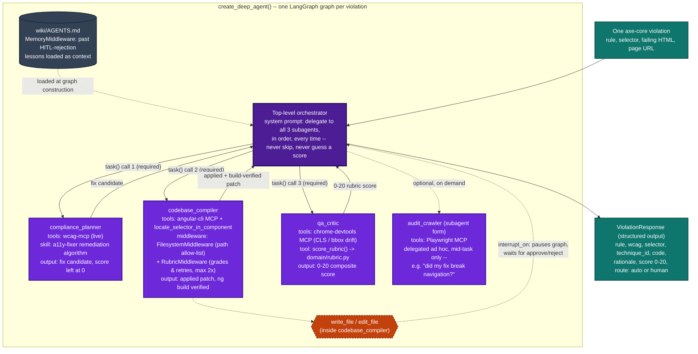

# The A11y Fixer — AI Orchestration Only

Scoped strictly to `deep_agent.py`'s `deepagents` graph — no CLI, no guardrails, no PR
delivery, no HITL dashboard. This is what runs once per violation, purely the agentic
reasoning layer. Read directly from the source on 2026-09-08.

Diagram source (click to expand)

## Reading the diagram

- **Teal** — the graph's input (one flattened axe-core violation) and output (the structured `ViolationResponse` — the only thing the rest of the system, `deliver_violation()`, ever sees from this graph).
- **Dark violet** — the top-level orchestrator. Its system prompt is deliberately strict: it must call all three subagents, in that exact order, every single time — it is explicitly forbidden from investigating or editing the codebase itself, or fabricating a score instead of getting one from `qa_critic`.
- **Violet** — the three subagents that are always called, plus `audit_crawler` in its ad hoc, LLM-driven form (distinct from the deterministic crawl used for the initial site-wide audit — that one lives outside this graph entirely).
- **Orange, dashed** — `interrupt_on`: every `write_file`/`edit_file` call inside `codebase_compiler` pauses the whole graph and waits for a human `approve`/`reject` decision before continuing.
- **Slate** — `wiki/AGENTS.md`, loaded once as memory context so the agent sees lessons learned from past human rejections.

**Verified:** rendered locally via `@mermaid-js/mermaid-cli` against a real headless Chromium — the actual render output, not a mockup.
