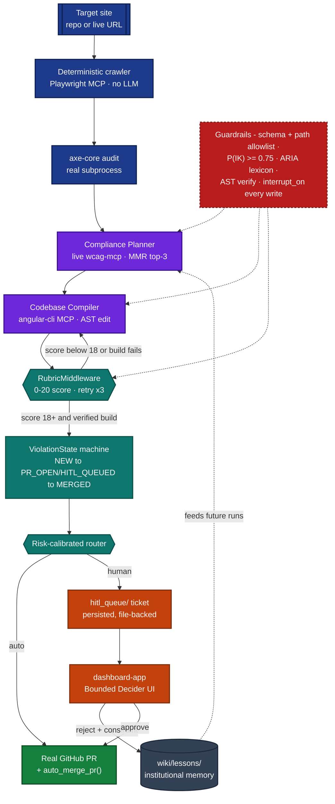

# The A11y Fixer

> ## 🅰️ The A11y Fixer — CMU Agentic AI Capstone (Module 7, Assignment 7.1)
>
> This repository is one of five that make up **The A11y Fixer**: an autonomous multi-agent system that crawls and audits Angular applications for WCAG 2.2 AA accessibility violations, and delivers verified, human-reviewable fixes as real pull requests — built for the CMU Agentic AI Program capstone.
>
> **This repo's role:** this is the core implementation — the CLI (`audit` / `run` / `review` / `queue-sync` / `fleet`), the three sub-agents (Compliance Planner / Codebase Compiler / QA Critic), the guardrail stack, and the evaluation harness.

| Repository | Role |
| --- | --- |
| [`a11y-fixer`](https://github.com/mdrmtz/a11y-fixer) | The autonomous agent itself — orchestration, sub-agents, CLI, guardrails, evaluation harness. **Start here for a technical review.** |
| [`dashboard-app`](https://github.com/mdrmtz/dashboard-app) | Human-in-the-loop review dashboard (Angular + Express) — the Bounded Decider UI. |
| [`cmu-capstone`](https://github.com/mdrmtz/cmu-capstone) | Umbrella project: links `a11y-fixer` and `dashboard-app` as real git submodules, hosts the capstone checkpoints and final report, and publishes the docs/chat site. |
| [`wcag-mcp`](https://github.com/mdrmtz/wcag-mcp) | Live WCAG 2.2 knowledge server (MCP) — queried at runtime, never a static cache. |
| [`Hallucinate.io`](https://github.com/mdrmtz/Hallucinate.io) | Deliberately-broken Angular fixture used as the benchmark/target site. |

**Final report & evaluation results:** see the final capstone report in [`cmu-capstone`](https://github.com/mdrmtz/cmu-capstone). **Live docs & project chat:** https://mdrmtz.mintlify.site

### Final system architecture




---

## Overview

An autonomous WCAG 2.2 AA remediation agent for Angular SPAs, built on
[`deepagents`](https://pypi.org/project/deepagents/). Given an axe-core
accessibility audit of the `Hallucinate.io` fixture app, it:

- Resolves each violation to a WCAG success criterion and technique by
  querying `wcag-mcp` live (never from static training data)
- Applies and verifies the code patch on the Angular fixture, via the
  official `angular-cli` MCP server
- Scores the candidate against a 0-20 rubric (deterministic build/AST/visual
  checks + an LLM WCAG-compliance judge)
- Routes the result to automatic PR delivery or a human review queue,
  depending on rubric confidence and rule risk
- Pauses for human approval on every file write (`interrupt_on`) regardless
  of that routing decision - a second, independent safety layer

The project runs with **no LLM API key** using deterministic domain logic
only (pure unit tests, the audit runner, sandbox adapters); a configured
backend (Ollama by default, or Anthropic/OpenAI/OpenRouter) is required to
actually drive the agent end-to-end.

## Project Structure

```text
agent/
├── pyproject.toml
├── .env.example
├── sandbox/
│   └── Dockerfile              # Phase G: drop-in Docker sandbox image
├── wiki/
│   └── lessons/                # HITL rejection lessons (institutional memory)
├── src/a11y_fixer/
│   ├── config.py                # fixture path, LLM backend, PR delivery mode
│   ├── cli.py                    # single entrypoint: `audit` / `run`
│   ├── deep_agent.py              # create_deep_agent() composition root
│   ├── domain/                    # pure logic - zero network, zero LLM
│   │   ├── tot_search.py            # Tree-of-Thought DFS (offline eval use)
│   │   ├── rubric.py                 # 0-20 composite scorer
│   │   ├── guardrail_rules.py         # schema/path/epistemic/overconfidence/calibration
│   │   └── hitl_policy.py              # risk-routing predicates
│   ├── agents/                    # SubAgent specs
│   │   ├── compliance_planner.py
│   │   ├── codebase_compiler.py
│   │   ├── qa_critic.py
│   │   └── audit_crawler.py
│   ├── adapters/
│   │   ├── audit_runner.py           # axe-core + ng serve lifecycle
│   │   ├── mcp_clients.py             # 6 MCP servers via langchain-mcp-adapters
│   │   ├── repo_source.py              # --repo: clone-or-use-as-is any target repo
│   │   ├── retrieval/                  # wiki pipeline + MMR semantic search
│   │   ├── sandbox/                     # git worktree + Docker backend
│   │   └── pr/delivery.py                # live/dry-run GitHub PR delivery
│   └── hitl/
├── evaluation/
│   ├── benchmark_cases.json      # 22 real violation instances (live audit)
│   └── run_eval.py                # HELM-aligned metrics over every case
├── triggers/github-actions/
│   └── a11y-fixer.yml
└── tests/
    ├── domain/       # pure logic, zero network
    ├── adapters/     # mocked ports + real disposable git repos
    ├── agents/
    └── e2e/          # real npm/git/Docker/network, skipped by default
```

## Setup

```zsh
cd cmu-capstone/agent
python3 -m venv .venv
source .venv/bin/activate
pip install -e ".[dev]"
```

The `Hallucinate.io` fixture is a git submodule (`cmu-capstone/Hallucinate.io`).
Install its own dependencies once:

```zsh
cd ../Hallucinate.io && npm install
```

Copy `.env.example` to `.env` at the `cmu-capstone/` repo root (config.py
searches upward for it) and fill in whichever provider you plan to use.
Nothing is required for `ollama` (the default) beyond a running local
Ollama server.

## Run

```zsh
# Run a fresh axe-core audit and save it
python -m a11y_fixer.cli audit --output evaluation/results/audit.json

# Drive the agent over every violation in that audit (dry-run PR delivery,
# auto-approving HITL prompts for a first unattended pass)
python -m a11y_fixer.cli run --audit evaluation/results/audit.json --no-live --yes
```

Both subcommands accept `--repo <path-or-url>` to point at any Angular repo
instead of the bundled fixture - a local checkout is used as-is, a git URL is
shallow-cloned into `evaluation/../.repo-cache/` (a fresh clone still needs
its own `npm install` before `audit`/`run` can start a dev server against it).
The resolved path is always printed (`target repo: ...`) so it's never a
hidden default:

```zsh
python -m a11y_fixer.cli audit --repo https://github.com/some-org/some-angular-app.git
python -m a11y_fixer.cli audit --repo ../path/to/an/already-cloned/repo
```

`--live` requires `GITHUB_TOKEN` (and `GITHUB_REPO`) to be set; omitting
`--live`/`--no-live` follows `GITHUB_TOKEN`'s presence automatically. Dry-run
writes a unified diff + PR description to `evaluation/results/prs/`.

`audit`/`run` also accept `--url <live-url>` to audit a running site directly
(no clone/build/`ng serve`) instead of `--repo`. Route discovery is fully
deterministic - a breadth-first crawl over direct Playwright MCP tool calls,
no LLM involved - and prints a live per-page crawl log so a run's actual page
coverage is directly observable:

```zsh
python -m a11y_fixer.cli audit --url https://hallucinate.netlify.app/
```

## CLI subcommands

| Subcommand | Purpose |
| --- | --- |
| `audit` | Run a fresh `axe-core` audit only (`--repo` / `--url` / `--config`) - writes `evaluation/results/audit.json`, no fixes attempted. |
| `run` | Full pipeline: audit (or replay `--audit <path>`) -> agent -> route -> deliver, for one repo. Dry-run by default; `--live`/`--no-live` forces the delivery mode. |
| `review` | List (`--list`) or decide (`--approve`/`--reject`) on items sitting in the file-backed `hitl_queue/`. |
| `queue-sync` | Auto-approve every queued item scoring >= 18.0 (`--auto-approve`); reconcile PRs merged manually on GitHub (`--check-merged`). |
| `fleet` | Run the full pipeline unattended against the one site declared in a manifest (`--config sites.yaml`). Defaults to **live** delivery, unlike `run` - pass `--dry-run` for a safe first try. See `sites.example.yaml`. |

```zsh
# Unattended, manifest-driven run against a real site (live by default)
python -m a11y_fixer.cli fleet --config sites.yaml --dry-run
```

## Environment Variables

See `.env.example`. Key ones:

| Variable | Purpose |
| --- | --- |
| `A11Y_LLM_BACKEND` | `ollama` (default) \| `anthropic` \| `openai` \| `openrouter` |
| `A11Y_LLM_MODEL` | Override the default model id for the selected backend |
| `GITHUB_TOKEN` / `GITHUB_REPO` | Live PR delivery (dry-run if unset) |
| `A11Y_FIXTURE_PATH` | Override the fixture location for non-standard checkouts |

## Tests

```zsh
pytest tests/ -q            # fast: pure logic + mocked/disposable-repo adapters
pytest tests/e2e/ -m e2e -v  # real npm/git/Docker/network - slower, opt-in
```

## Notes on deviations from `agent-plan.md`

- **PR delivery** talks to the GitHub REST API directly (`httpx`) instead of
  wiring `@modelcontextprotocol/server-github`: a one-shot procedural call
  doesn't benefit from the MCP protocol layer the way LLM-driven tool calls do.
- **`permissions=` vs. execution-capable backends are mutually exclusive** in
  the installed `deepagents` version (`FilesystemMiddleware` raises
  `NotImplementedError` otherwise). The deep agent keeps `permissions=` (real
  write-scope enforcement) and uses a non-execution `FilesystemBackend`;
  `codebase_compiler` runs `ng build`/`ng test` via the angular-cli MCP's
  `run_target` tool instead of deepagents' native `execute` tool.
- Git-worktree-per-candidate isolation (`adapters/sandbox/git_worktree.py`)
  and the Docker sandbox (`adapters/sandbox/docker_backend.py`) don't compose
  with deepagents' single shared backend, so they aren't wired as live agent
  tools. Both are real, tested adapters used procedurally by the evaluation
  harness instead.
- `RubricMiddleware` takes `model`/`system_prompt`/`max_iterations`, not a
  structured `rubric=` dict - the rubric criteria live in its system prompt.
